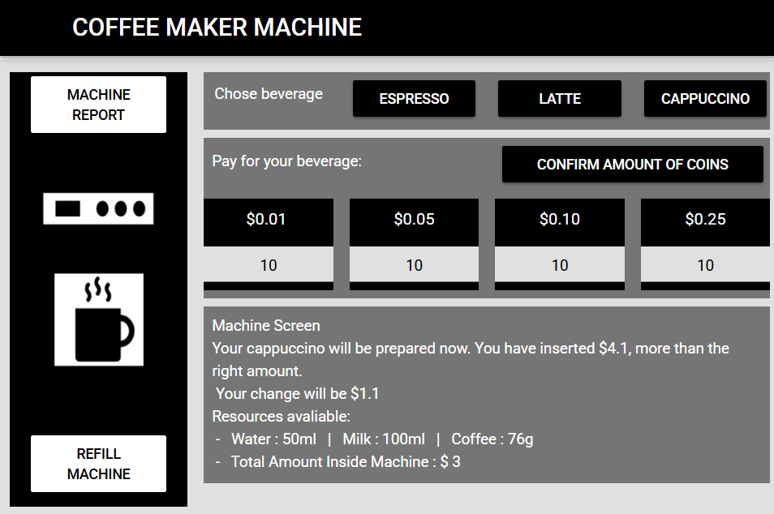

# Coffee Machine Simulator

Portfolio Game page link: [Access Portfolio](https://meduardaeneves.github.io/portfolio/games/coffee_machine_simulator/)

  

This is a Coffee Machine Simulator. The idea is to simulate how a coffee machine works with all its aspects: Choosing a beverage, inserting coins, validate the amount of coins inserted and prepare or not the beverage.

To play the game you can enter the game's Portfolio Link, for online access, or download all the python files in this repository and execute it in your personal code editor. To execute this second way you need to play the "sec016_mine_project_code. py" file.

## Game Rules
  

    <ul>
      <li>The coffee machine in question is capable of preparing 3 beverages:
        <ul>
          <li>Espresso;</li>
          <li>Latte;</li>
          <li>Cappuccino</li>
        </ul>
      </li>
      <li>If you Click on the "Machine Report button, it will present the remaining ingredients in the machine, alongside the amount of money that it received".</li>
      <li>If you Click on the "Refill Machine" button, it will refresh the Coffee Machine setting it's ingredients to the default amount value:
        <ul>
          <li>Water: 300 ml;</li>
          <li>Milk: 200 ml;</li>
          <li>Coffee: 100 g;</li>
          <li>Total Amount: $ 0;</li>
        </ul>
      </li>
      <li>Each beverage requires a certain amount of ingredients at a specific cost:
        <ul>
          <li>Espresso   - 50ml  of Water | 18g of coffee | 0g  of coffee | Cost: $ 1.50;</li>
          <li>Latte      - 200ml of Water | 150ml of Milk | 24g of coffee | Cost: $ 2.50;</li>
          <li>Cappuccino - 250ml of Water | 100ml of Milk | 24g of coffee | Cost: $ 3.00</li>
        </ul>
      </li>
      <li>Once you've chosen a beverage, the machine will decide if it has sufficient ingredients to prepare it. If positive, you will proceed to payment. If negative, you will be asked to choose either another beverage or refresh the machine.</li>
      <li>
        Once the payment is allowed, you need to specify the amount of coins you're going to insert on it.
        <ul>
          <li>If the amount of money is not enough, the beverage will be canceled and the money returned</li>
          <li>If the amount of money is enough, the beverage will be prepared, your change, if exits, will be given and the amount of ingredients needed to prepare the beverage will be removed from the machine</li>
        </ul>
      </li>
    </ul>
  

