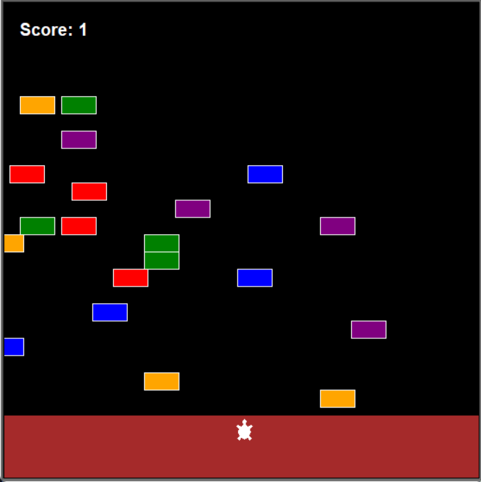

# Cross the Street Game App

Portfolio Game page link: [Access Portfolio](https://meduardaeneves.github.io/portfolio/games/cross_street_game/)

  

This is a Cross the Street Game App. Your goal is to move the turtle using the keyboard arrows in order to reach the other side of the road, avoiding the obstacles.

To play the game you can download the .exe file (located in "files" folder) or download all the python files in this repository and execute it in your personal code editor.

## Game Rules

    <ul>
      <li>The rules for the game are very simple:
        <ul>
          <li>Each time you succeed crossing the street, you gain a point and the turtle goes back to the start position so you can try again but with faster obstacles.</li>
          <li>The game ends once you bump into any obstacle.</li>
        </ul>
      </li>
    </ul>
  

