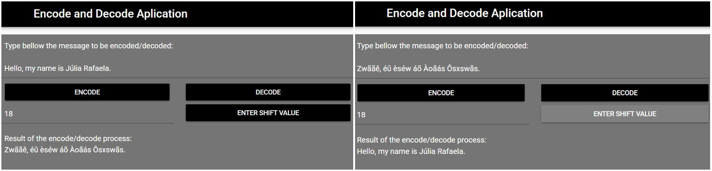

# Encode Decode Game

Portfolio Game page link: [Access Portfolio](https://meduardaeneves.github.io/portfolio/games/encode_decode/)

  

This is an "Encode & Decode Message Game".

To play the game you can enter the game's Portfolio Link, for online access, or download all the python files in this repository and execute it in your personal code editor. To execute this second way you need to play the "sec008_mine_final_project.py" file.

## Game Rules
  

    <ul>
      <li>The encode & decode game allows you to write a message, chose a "shift" value, and it will return you an encoded message of the text you wrote.</li>
      <li>You can pass the message to another person with the shift number that was used and whoever has it can decode the message</li>
      <li>The steps to use the app are really simple:
        <ul>
          <li>Write the message you want to encode/ decode</li>
          <li>Chose a "shift" value that will allow each letter of the message to gain another value</li>
          <li>Enter the Shift value chosen</li>
          <li>The result message will appear in the "Result of the encode/decode process" box area.</li>
        </ul>
      </li>
    </ul>
  

