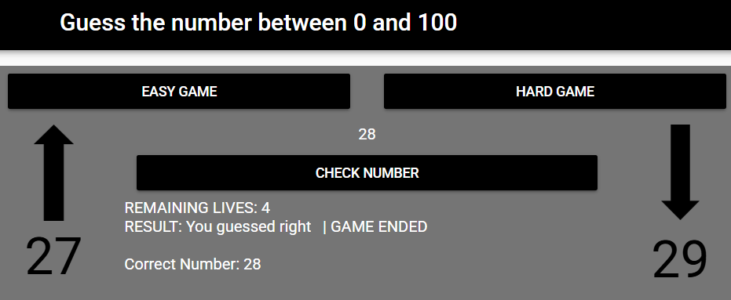

# Guess the Number Game (0 - 100)

Portfolio Game page link: [Access Portfolio](https://meduardaeneves.github.io/portfolio/games/guess_the_number/)

  

This is a "Guessing Number Game" and your goal is to guess the random number, between 0 and 100, the computer has chosen.

To play the game you can enter the game's Portfolio Link, for online access, or download all the python files in this repository and execute it in your personal code editor. To execute this second way you need to play the "sec012_mine_final_project.py" file.

## Game Rules
  

    <ul>
      <li>To play this game, the first thing you need to choose is the type of game you want to play:
        <ul>
          <li>EASY: 10 lives to guess the number</li>
          <li>HARD: 5 lives to guess the number</li>
        </ul>
      </li>
      <li>You need to type a number and then check its value in the "Check Number" button</li>
      <li>If the number is incorrect you will lose a life and the game will inform the new range the correct number is inserted, considering the number you tried</li>
      <li>The game will end if you get the number correct or if you run out of lives. In both cases the correct number will be presented to you</li>
    </ul>
  

