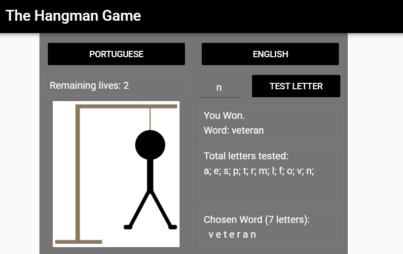

# The HangMan Game

Portfolio Game page link: [Access Portfolio](https://meduardaeneves.github.io/portfolio/games/hangman/)

  

This is a hangman game. Your goal is to guess the word chosen by the pc. The game is available in engish and portuguese. Before you start guessing you need to choose what language you want to play.

To play the game you can enter the game's Portfolio Link, for online access, or download all the python files in this repository and execute it in your personal code editor. To execute this second way you need to play the "sec007_my_finalproject.py" file.

## Game Rules
  

    <ul>
      <li>Each time you click into "PORTUGUESE" or "ENGLISH" a new game starts</li>
      <li>To try a letter you need to enter it in the proper writing space and click "TEST LETTER"</li>
      <li>For this game, exists 6 and 7 letters words, 500 units of each, for both languages. The exception is the group of 6 letters words in english, it contains 140 unis:
        <ul>
          <li>The portuguese words were extracted from the <a href='https://www.dicio.com.br/exemplos-de-palavras/'>"Dicionário Online de Português"</a></li>
          <li>The 6 letter words in english were extracted from the <a href='https://testbook.com/english-grammar/6-letter-words'>"Testbook"</a></li>
          <li>The 7 letter words in english were extracted from the <a href='https://byjus.com/english/7-letter-words/'>"BYJU'S website"</a></li>
        </ul>
      </li>
      <li>You will have 8 chances to guess the correct word</li>
      <li>If you guess the word correct before running out of lives you will win the game, otherwise you will lose and the correct word will be presented.</li>
    </ul>
  

