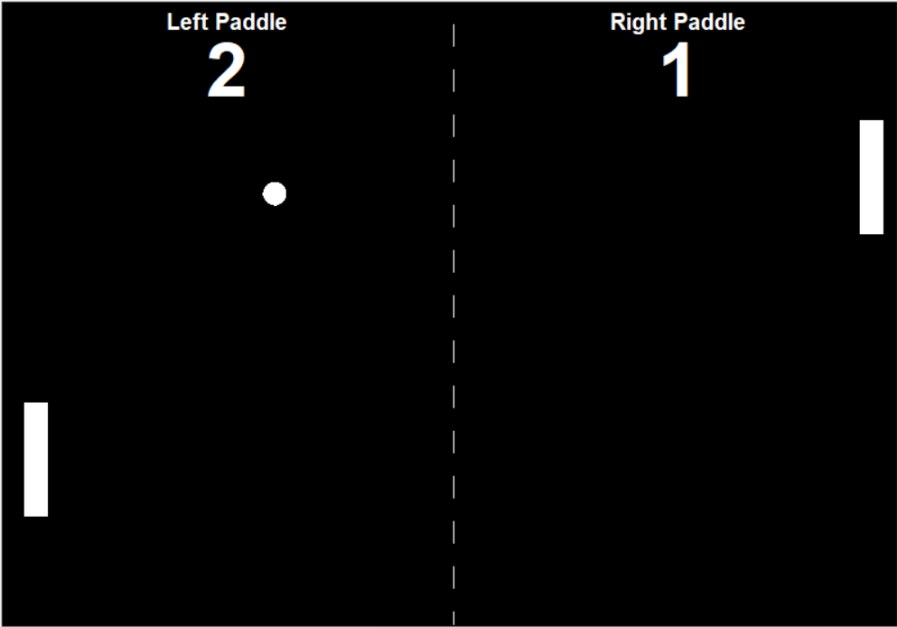

# Pong Game App

Portfolio Game page link: [Access Portfolio](https://meduardaeneves.github.io/portfolio/games/paddle_pong_game/)

  

This is a Paddle Pong Game App. It requires two players. Your goal is to hit the ball with the paddle and try to make the other opponent to miss the ball. 

To play the game you can download the .exe file (located in "files" folder) or download all the python files in this repository and execute it in your personal code editor.

## Game Rules

    <ul>
      <li>The rules for the game are very simple:
        <ul>
          <li>To control the left paddle you must use "W" for up and "S" for down.</li>
          <li>To control the right paddle you must use the "up arrow" for up and "down arrow" for down.</li>
          <li>If your opponent misses the ball, you gain a point.</li>
          <li>The game ends once one of the players reaches 5 points.</li>
        </ul>
      </li>
    </ul>
  

