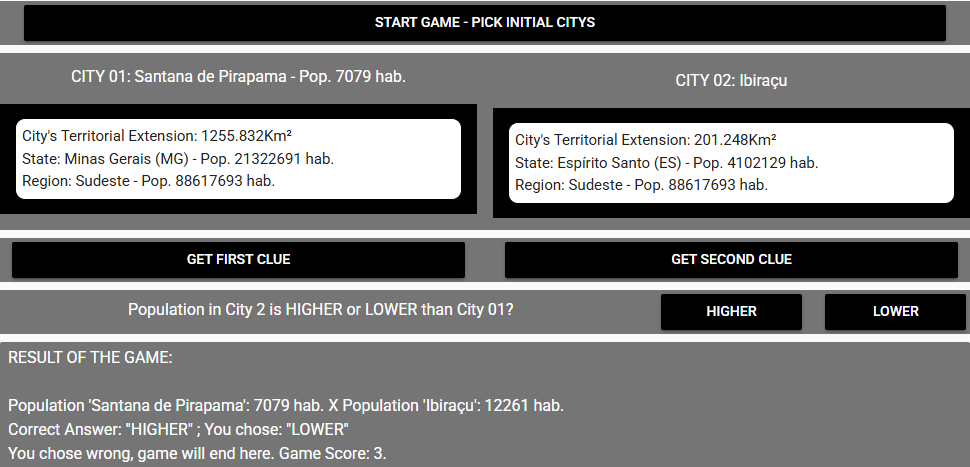

# Population Higher or Lower Game

Portfolio Game page link: [Acess Portfolio](https://meduardaeneves.github.io/portfolio/games/population_higher_lower/)

  

This is Population High or Lower game. 

To play the game you can enter the game's Portfolio Link, for online access, or download all the python files in this repository and execute it in your personal code editor. To execute this second way you need to play the "sec014_mine_final_project_game.py" file.

This Game collect its data from the IBGE DataBase: 
  <ul>
    <li>Population estimation for Brazi's cities (from 01.07.2024). File's name: ["Estimativas de população publicadas no DOU"](https://www.ibge.gov.br/estatisticas/sociais/populacao/9103-estimativas-de-populacao.html)
    </li>
    <li>Brazil's cities area (2022 file). File's name: ["AR_BR_RG_UF_RGINT_MES_MIC_MUN_2022.xls"](https://www.ibge.gov.br/geociencias/organizacao-do-territorio/estrutura-territorial/15761-areas-dos-municipios.html?=&t=downloads)
    </li>
  </ul>

## Game Rules

  <ul>
    <li>You will be presented with two Brazilian's cities.</li>
    <li>To gain those cities you need to press the "Start Game - Pick Initial cities Button".</li>
    <li>Your goal is to decide if the second city presented has a HIGHER or LOWER population compared to the first one.</li>
    <li>If you get it right, you will gain points and the game will continue: The second city will turn into the first and you will receive another one for the second spot.</li>
    <li>If you get it wrong, the game ends and your final points are presented.</li>
    <li>
      At the start of the game, you will be presented the following information:
      <ul>
        <li>City names, with the population of the first one.</li>
        <li>The state and region they belong, alongside the region's population</li>
      </ul>
    </li>
    <li>
      If you desire, you can ask up to two clues:
      <ul>
        <li>CLUE 01: Population of the states</li>
        <li>CLUE 02: Both cities territorial extension</li>
      </ul>
    </li>
      Your points will follow a logic:
      <ul>
        <li>0 CLUE: 3 points</li>
        <li>1 CLUE: 2 points</li>
        <li>2 CLUE: 1 points</li>
      </ul>
    </li>
    <li>Try to get the maximum amount of points you can.</li>
  </ul>
