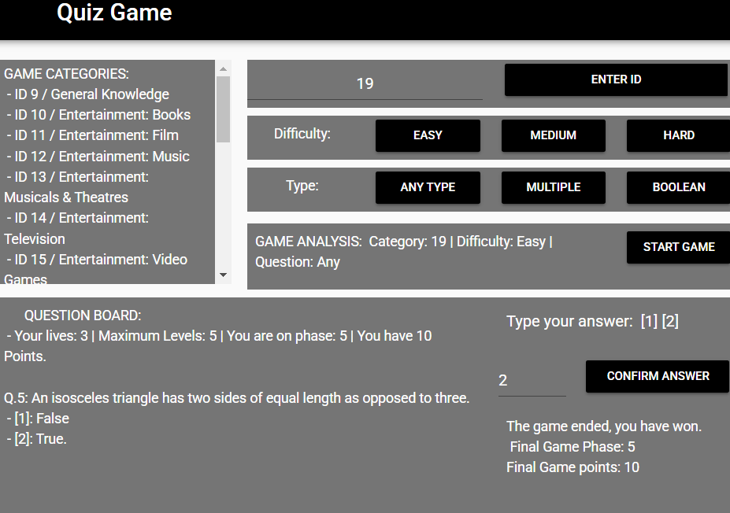

# The Trivia Quiz Game

Portfolio Game page link: [Acess Portfolio](https://meduardaeneves.github.io/portfolio/games/quiz_game/)

  

This is Trivia question game. 

To play the game you can enter the game's Portfolio Link, for online acess, or download all the python files in this repository and execute it in your personal code editor. To execute this second way you need to play the "game_play.py" file.

 
This Game collect its data from the Open Trivia DataBase: [Acess Website](https://opentdb.com/) using API to get the questions.

## Game Rules

  <ul>
    <li>
      The questions in this trivia game will vary in three aspects:
      <ul>
        <li>Their category</li>
        <li>Their difficulty</li>
        <li>
          The type of question:
          <ul>
            <li>True or False (boolean)</li>
            <li>Multiple Choice (multiple)</li>
            <li>Any (both multiple and boolean)</li>
          </ul>
        </li>
      </ul>
    </li>
    <li>
      You need to choose each of these aspects to start the game. Once you have chosen them, press the "START GAME" button. Each time you press this button, a new game begins.
    </li>
    <li>Each game consists of a maximum of 5 phases, with one question per phase.</li>
    <li>
      You have 3 lives. If you get a question wrong, you remain in the same phase but lose a life.
    </li>    
    <li>
      Depending on the aspects you have chosen, the game may have fewer than 5 phases due to the reduced number of questions available. In this case, your number of lives will be reduced to 1.  
    </li>
    <li>
      Your goal is to answer questions correctly and progress through the phases. To submit your answer, enter its value in the "Value" box and confirm it by pressing the "CONFIRM ANSWER" button.
      <ul>
        <li>You earn 2 points for each phase you win.</li>
        <li>You lose 1 point for each phase you fail.</li>
        <li>If you reach the final phase and answer correctly, you win the game.</li> 
        <li>If you run out of lives, you lose the game.</li>
      </ul>
    </li>
    <li>
      Once the game has ended, two parameters will be displayed:
      <ul>
        <li>Your current phase</li>
        <li>Your total points</li>
      </ul>
    </li>
  </ul>
