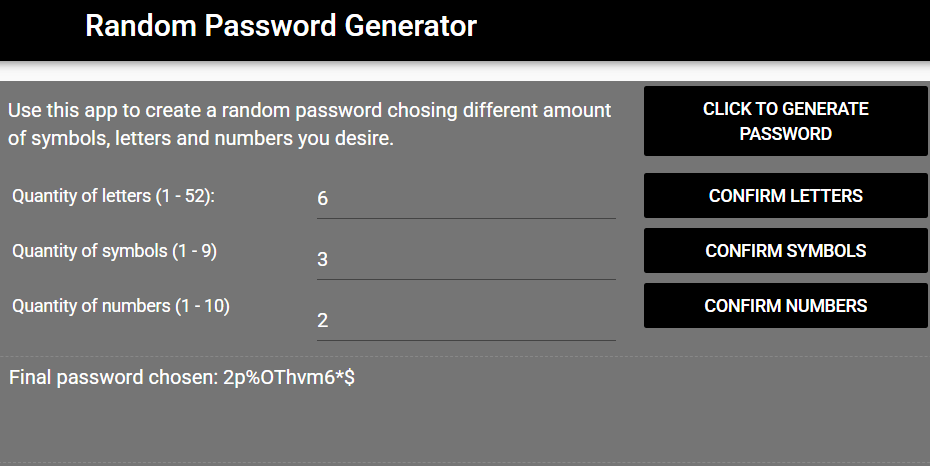

# Random Password Generator

Portfolio Game page link: [Access Portfolio](https://meduardaeneves.github.io/portfolio/games/random_password_generator/)

  

This is a random password generator. You will have the PC´s help to decide a new password for yourself. The amount of elements available for you are:
  <ul>
    <li>52 letters (26 lowercase and 26 uppercase)</li>
    <li>10 numbers (from 0 to 9)"</li>
    <li>9 symbols: ['!', '#', '$', '%', '&', '(', ')', '*', '+']</li>
  </ul>

To play the game you can enter the game's Portfolio Link, for online access, or download all the python files in this repository and execute it in your personal code editor. To execute this second way you need to play the "sec005_finalProject.py" file.

## Game Rules
  

    <ul>
      <li>The Random Password Generator allows you to generate a random password by chosing different amount of elements it must contain.</li>
      <li>The steps to use the app are really simple:
        <ol>
          <li>Write the amount of letter you want (submit by clicking "confirm letters")</li>
          <li>Write the amount of numbers you want (submit by clicking "confirm numbers")</li>
          <li>Write the amount of symbols you want (submit by clicking "confirm symbols")</li>
          <li>Enter "Click to Generate Password" to receive the result.</li>
        </ol>
      </li>
    </ul>
  

