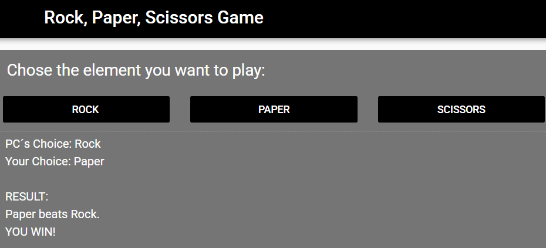

# Rock, Paper, Scissors

Portfolio Game page link: [Access Portfolio](https://meduardaeneves.github.io/portfolio/games/rock-paper-scissors/)

  

This is a Rock, Paper, Scissors game you will play agains the PC.

The game will happen with you chosing the element you want to enter:
  <ul>
    <li>Rock</li>
    <li>Paper</li>
    <li>Scissors</li>
  </ul>

To play the game you can enter the game's Portfolio Link, for online access, or download all the python files in this repository and execute it in your personal code editor. To execute this second way you need to play the "rock_paper_scissors.py" file.

## Game Rules
  

    <ul>
      <li>The rules for the game are very simple:
        <ul>
          <li>Rock beats Scissors</li>
          <li>Scissors beats Paper</li>
          <li>Paper beater Rock</li>
        </ul>
      </li>
    </ul>
  

