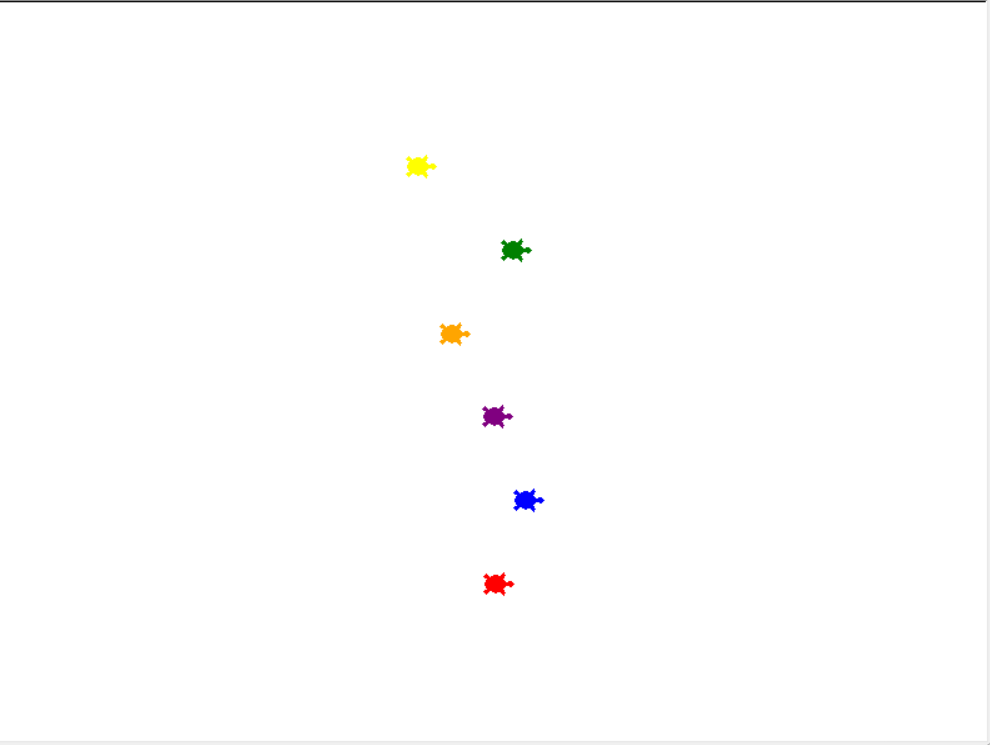

# Turtle Racing App

Portfolio Game page link: [Access Portfolio](https://meduardaeneves.github.io/portfolio/games/turtle_racing/)

  

This is a turtle racing app. Your goal is to choose a colour of turtle and root for it to win.

To play the game you can download the .exe file (located in "files" folder) or download all the python files in this repository and execute it in your personal code editor.

## Game Rules

    <ul>
      <li>The rules for the game are very simple:
        <ul>
          <li>The turtles will wall by random paces aiming the finish line (right wall).</li>
          <li>The game ends once any turtle reaches the right wall.</li>
          <li>If the turtle you chose arrived first you win, otherwise you lose.</li>
        </ul>
      </li>
    </ul>
  

