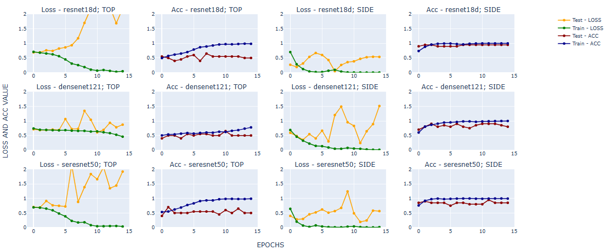
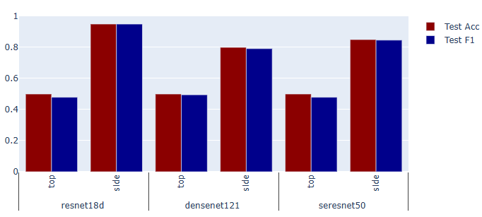
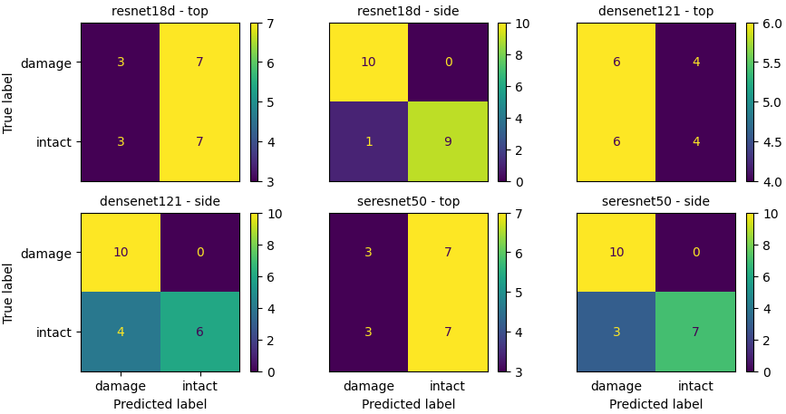
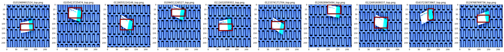
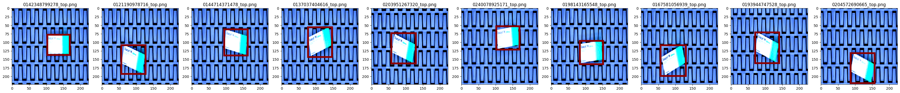
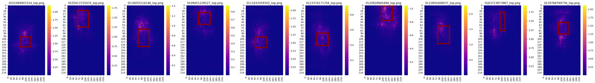
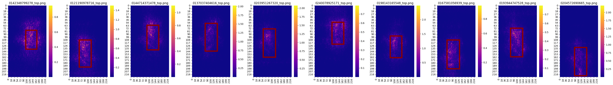

# Machine Learning: Identificação de Emabalagens Danificadas

# Links de acesso:
- [Link para acesso ao Google Colab](https://colab.research.google.com/drive/1HZ079HYk651VT-CmXUTyvnYFi3sfuTpk?usp=sharing)
- Arquivo ".ipynb" para rodar o projeto: machine_learning_damaged_boxid.ipynb. Entretanto, para conseguir executar o projeto, é necessário executar um pequeno processo:
    - Descompactar a pasta dataset-desafio
    - Adicionar o arquivo do colab na pasta dataset-desafio
    - adicionar a pasta dataset-desafio ao google drive, dentro da pasta:
        - gdrive/MyDrive/Colab Notebooks
    - Dentro da pasta detaset-desafioterá uma pasta chamada dataset-desafio-MEduarda que vai conter todos os resultados apresentados quando o programa foi rodado por mim, como por exemplo, as imagens geradas pelo augmentation, dentro de suas respectivas pastas, e os checkpoints salvos.
- [Link de acesso para o portfólio em Inglês](https://meduardaeneves.github.io/portfolio/personal-projects/machine_learning_damaged_boxid/)

# Objetivos do projeto
- O objetivo do projeto desenvolver modelos de aprendizagem de máquina cujo objetivo é identificar e classificar pacotes danificados
- Foram gerados três modelos e feita uma comparação entre eles, para identificar aquele que melhor atendeu o objetivo
- Os dados foram disponibilizados durante o curso de pós-graduação e são imagens que foram geradas artificialmente

# Descrição da Técnica escolhida para a Solução do problema
Para solucionar o problema em questão, este projeto optou por fragmentar a o desenvolvimento técnico em quatro partes:
1. Carregamento dos Dados:
2. Pré-Processamento dos Dados
3. Treinamento dos modelos
4. Mapa de Interpretabilidade

## Carregamento dos Dados
- Os dados foram carregados da forma correta como explicado anteriormente e inseridos dentro do "gdrive/MyDrive/Colab Notebooks"
- O dataset apresenta imagens de caixas de remédios intactas e danificadas, em dois sentidos: top (topo) e side (lado)
- O DataSet completo contém os dados separados em treinamento e teste
    - A pasta de "Interpretabilidade" é a pasta que contém os arquivos de teste. Contém um total de 20 imagens do tipo danificadas e 20 do tipo intactas, sendo metade do tipo "top" e metade do tipo "side"
    - As pastas "DAMAGE" e "INTACT" contém as imagens de treinamento referente às caixas danificadas e intactas, respectivamente. São 180 imagens de cada tipo, sendo 90 "top" e 90 "side" em ambos os casos.

## Pré-Processamento dos Dados
- Os modelos utilizados para treinar as imagens são pré-treinados, entretanto, antes de serem aplicados, é necessário realizar pré-processamento nas imagens
- Foi utilizado o "Pytorch transformers" para aplicar DataAugmentation no DataSet, isso fez com que as imagens, dentro de uma mesma classe, tivessem uma maior variação, permitindo melhor classificação
- Com o DataSet pronto, deu-se início a criação do DataLoad de treinamento e de teste, são esses os que serão utilizados pelo modelo para a classificação

## Treinamento dos modelos
- Para iniciar o processo de classificação foram utilizados três modelos pré-treinados:
    - Resnet 18D
    - DenseNet 121
    - SeresNet 50
- Os modelos foram obtidos através da [Biblioteca Timm](https://huggingface.co/docs/timm/index)
- Em seguida, os modelos foram treinado por 15 épocas a fim de conseguir bons resultados de clasisifcação
- Por último, são escolhidos os parâmetros dos modelos que apresentaram os melhores resultados em determinada época e eles são salvos para definição do modelo final

## Mapa de Interpretabilidade
- Além das imagens fornecidas, o dataset também continha o bound-box para cada uma delas
    - O bound-box da imagem é aquela região que mais influencia na sua classificação
- A ideia do mapa de interpretabilidade é gerar, a partir da classificação prevista das imagens, um mapa de calor a fim de visualizar as regiões mais influentes.
- Considera-se então, que o modelo foi mais importante/relevante quando houve coincidência entre o bound-box e as regiões relevantes do mapa de interpretabilidade

# Resultados
- A imagem abaixo apresenta os gráficos de Loss e Acurácia ao longo das épocas de treinamento, para os três modelos existentes em cada uma das variações das imagens "top" e "side"

- De posse dos parâmetros que apresentaram melhores valores em determinada época, é possível obter os valores de acurácia e de f1, para cada um dos diferentes modelos.
- A tabela e o gráfico abaixo apresentam um resumo destes resultados:

| arquitetura  | top_side | summary_path                        | test_acc | test_F1  |
|-------------|---------|------------------------------------|---------|---------|
| resnet18d  | top     | summary_top_resnet18d.pth         | 0.50    | 0.479167 |
| resnet18d  | side    | summary_side_resnet18d.pth        | 0.95    | 0.949875 |
| densenet121| top     | summary_top_densenet121.pth       | 0.50    | 0.494949 |
| densenet121| side    | summary_side_densenet121.pth      | 0.80    | 0.791667 |
| seresnet50 | top     | summary_top_seresnet50.pth        | 0.50    | 0.479167 |
| seresnet50 | side    | summary_side_seresnet50.pth       | 0.85    | 0.846547 |

- Finally, it is possible to observe the confusion matrix for each model of classification that was generated:

## Mapa de Interpretabilidade
- A imagem abaixo apresenta um exemplo de como o bound-box se enquadra nas imagens originais fornecidas pelo dataset, primeiramente na classificação do tipo "damage", seguido da "intact" no tipo "Top"

- Foram feitos os mapas de interpretabilidade para cada um dos casos existentes. Abaixo serão apresentados, para título de exemplo, somente aqueles do Modelo Resnet18 - top, damage e intact, respectivamente

# Consclusão
- Os modelos Resnet18 e SeresNet50 apresentaram melhores resultados para a classificação dos dados, obtendo maior valor de acurácia e de F1 na etapa de avaliação, tendo maior facilidade de identificar elementos na posição `side`, aos elementos de posição `top`
- Através da matriz de confusão observa-se que, para os três modelos, é mais fácil de realizar a classificação quando o elemento está na posição `side`. Ademais, a maior dificuldade de classificação se deu com os elementos de label `intact` classificando-os erroneamente como `damage`
- Nenhum dos modelos apresentou bons resultados para imagens de posição `top` devido à baixa acurácia obtida. Ademais, os modelos Resnet e SeresNet tiveream uma dificuldade, neste caso, de classificar imagens do tipo damage, colocando-as como intact
- Com relação aos mapas de interpretabilidade, observou-se uma similaridade entre os modelos apresentados, em que a região de interesse dos mapas se aproxima mais do bound-box nos casos em que a imagem está danificada, enquanto que na imagem intacta a região de interesse tem uma espacialização a mais com relação ao bound-box.
    - Os modelos foram consistentes na hora de apresentar os resultados, indepentente das labels(damage ou intact) ou do lado visto (top ou side). Enquanto que os modelos 01 e 03 (ResNet18 e Se-ResNet50, respectivamente)conseguiram identificar melhor a região de interesse, encaixando-a melhor no bound-box, o modelo 02(DenseNet121) apresentou o pior resultado.
    - Um erro que se apresentou frequente em todos os modelos e até mesmo na variação de side, top, foi a influência da imagem de fundo, porém, em alguns com uma influência maior que outra. Muitas vezes o programa identificou uma região de interesse fora do bound-box muito forte, apontando que ele estava dando certa importância para o fundo da imagem e não somente para a caixa, como deveria ser o ideal.
    - Estes mapas podem ser aplicados para gerar um novo teste do modelo no futuro, com algumas modificações:
        - Neste teste pode ser feita a exclusão do fundo das imagens, antes de gerar o treinamento do modelo, para que eles não venham a influenciar nova na região de decisão da imagem.
        - Ademais, pode-se utilizar o augmentation para aumentar a quantidade de imagens do tipo intact visto que esta foi a label mais difícil de classificar.
