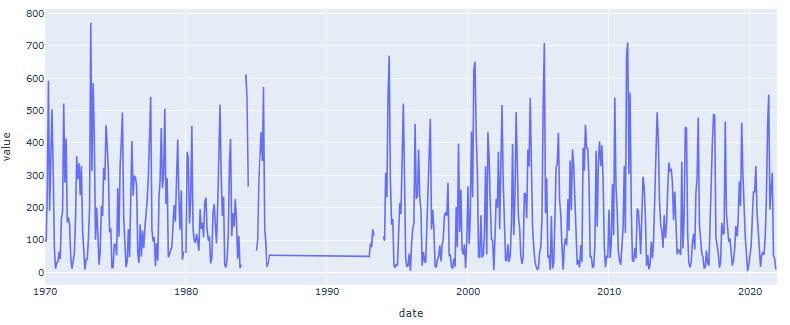
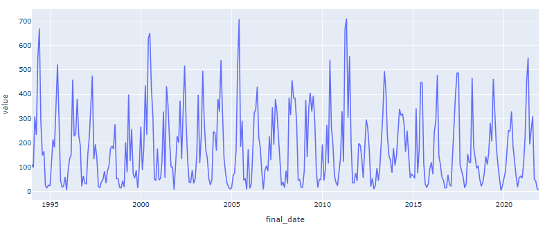
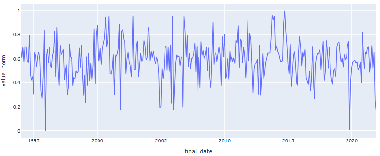
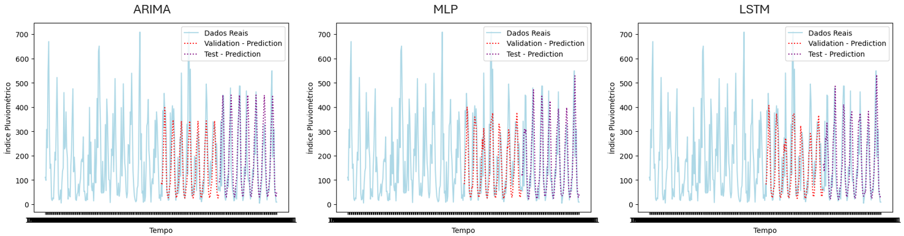

# Séries Temporais: Previsão de Índices Pluviométricos na cidade do Recife

# Links de acesso:
- [Link de acesso para o Google Colab](https://colab.research.google.com/drive/1okAfjRb37y3Vv_tFgDdIwS0JD0KNr0mn?usp=sharing)
- Arquivo ".ipynb" para rodar o projeto: projeto_final_st_mariaEduardaNeves.ipynb
- [Link de acesso para o portfólio em Inglês](https://meduardaeneves.github.io/portfolio/personal-projects/times_series_rainfall/)

# Objetivos do Projeto

- O projeto tem como objetivo desenvolver um Modelo de Aprendizado de Máquina que visa prever a precipitação na cidade do Recife, Pernambuco - Brasil
- Os dados foram coletados através da [APAC](http://old.apac.pe.gov.br/meteorologia/monitoramento-pluvio.php#), que retorna os dados de uma estação pluviométrica, denominada "Recife (Várzea)", localizada na região metropolitana do Recife.

# Desenvolvimento do Projeto

O desenvolvimento do projeto pode ser segmentado em três partes:
1. Carregamento dos Dados
2. Pré-Processamento dos Dados
3. Desenvolvimento do Modelo

## Carregamento dos Dados
- Para o projeto, os únicos dados necessários foram os coletados do site "APAC".
- Descrição dos dados:
  - Planilha em formato ". csv" que traz informações de chuvas, formato mensal.
  - O primeiro ano observado é 1970 e o último, 2021
- Abaixo é apresentado um gráfico mostrando a distribuição da chuva ao longo dos anos

## Pré-Processamento dos dados:
- Nesta fase, foram feitas algumas modificações nos dados, tornando-os adequados para a implementação do modelo
- O dataset apresentou um lapso no tempo (1985 - 1993), portanto, o conjunto de dados foi modificado para começar apenas em 1994.
- As lacunas no conjunto de dados foram preenchidas com a função "ffill".
- A função log foi implementada para remover assimetria no conjunto de dados.
- Por fim, os dados foram normalizados utilizando a lógica MIN-MAX.
- O gráfico abaixo mostra a distribuição da chuva ao longo dos anos, a partir de 1994, e antes de qualquer outra modificação dos dados.

- Este segundo gráfico mostra a distribuição da chuva ao longo dos anos, começando em 1994, após a modificação dos dados.

## Desenvolvimento do Modelo
- Para este projeto, foram desenvolvidos três modelos, com a ideia de comparar os resultados entre eles e escolher o que melhor representasse os dados:
  1. Arima Model
  2. MLP Model
  3. LSTM Model
- Para todos os modelos, os dados foram divididos da seguinte forma::
- 50% Treinamento
- 25% Validação
- 25% Teste

### Modelo ARIMA
- O modelo ARIMA é uma Média Móvel Integrada Autorregressiva
- Tem como objetivo prever o valor futuro com base em:
  - Valores passados (AR)
  - Diferenciação para alcançar valores estacionários (I)
  - Erros passados para melhorar previsões (MA)
- Recebe três parâmetros para o seu cálculo:
  - P: Parâmetro autorregressivo
  - D: Parâmetro de diferenciação
  - Q: Parâmetro da média móvel
- A metodologia Box & Jenkins foi utilizada para validar os parâmetros escolhidos

### Modelo MLP e LSTM
- Para ambos os modelos, foi utilizada uma "janela deslizante" para criar novos dados.
  - Esta metodologia escolhe uma quantidade de valores passados e adiciona como nova informação aos dados atuais de precipitação. 
- Além disso, para ambos os modelos foi utilizado um método de Grid Search a fim de procurar os parâmetros do modelo que apresentaram os melhores resultados.
- MLP é um modelo "Multilayer Perceptron". Para este projeto, foi usado "MLPRegressor" de "sklearn.neural_network"
-  O LSTM é uma "Longa Rede de Memória a Curto Prazo". Se difere do MLP por ser um modelo 2D, portanto é necessário "achatar" seus dados. Neste caso, utilizou-se um modelo sequencial, seguido de uma camada LSTM, com os parâmetros que foram escolhidos e, por último, uma camada densa.

# Resultados
## Comparação entre os três modelos
- Abaixo, apresenta-se uma tabela com os resultados das métricas obtidas pelos modelos

| Models        | RMSE validation | RMSE test | MAE validation | MAE test | R2 validation | R2 test |
|--------------|----------------|-----------|---------------|---------|--------------|---------|
| ARIMA (0,0,2) | 113.89         | 104.12    | 75.79        | 72.08   | -0.0603      | 0.4723  |
| MLP          | 108.53         | 100.38    | 71.96        | 69.80   | 0.1235       | 0.4550  |
| LSTM         | 110.06         | 102.46    | 73.41        | 71.38   | 0.0591       | 0.4234  |

- Abaixo, são apresentados, lado a lado, os gráficos gerados por cada modelo
  

- De acordo com os resultados, o MLP apresentou as melhores métricas
- Seus resultados foram bem parecidos com o LSTM, entretanto, ele foi superior na fase de validação

# Conclusão
- Comparando as métricas obtidas e os gráficos gerados, é possível concluir que o modelo que melhor se adaptou aos dados foi o MLP.
- Os resultados mostram que os modelos encontram dificuldade em prever principalmente os valores dos picos de precipitação
- A dificuldade pode estar relacionada com o tipo de dados. Existem muitos outliers que foram encontrados no modelo

